# Sexy.ai Landing Page

## Overview

This is the documentation for managing updates to our Sexy.ai landing page hosted on Google Sites and tracking changes on GitHub. This guide provides step-by-step instructions on how to make changes to the website, export the updated files using Google Takeout, and finally, update the GitHub repository with the latest changes.

### Table of Contents

1. [Getting Started](#getting-started)
2. [Making Changes to the Website](#making-changes-to-the-website)
3. [Exporting Files using Google Takeout](#exporting-files-using-google-takeout)
4. [Updating the GitHub Repository](#updating-the-github-repository)

## Getting Started 

>[!CAUTION]
>Before you begin, make sure you have the necessary access permissions to edit the Google Sites website and the GitHub repository associated with the project.

## Making Changes to the Website 

### Go To Dashboard
- Open your web browser and navigate to the employee dashboard and click on `Sexy AI Google Sites` tab under the `Website Design` section.
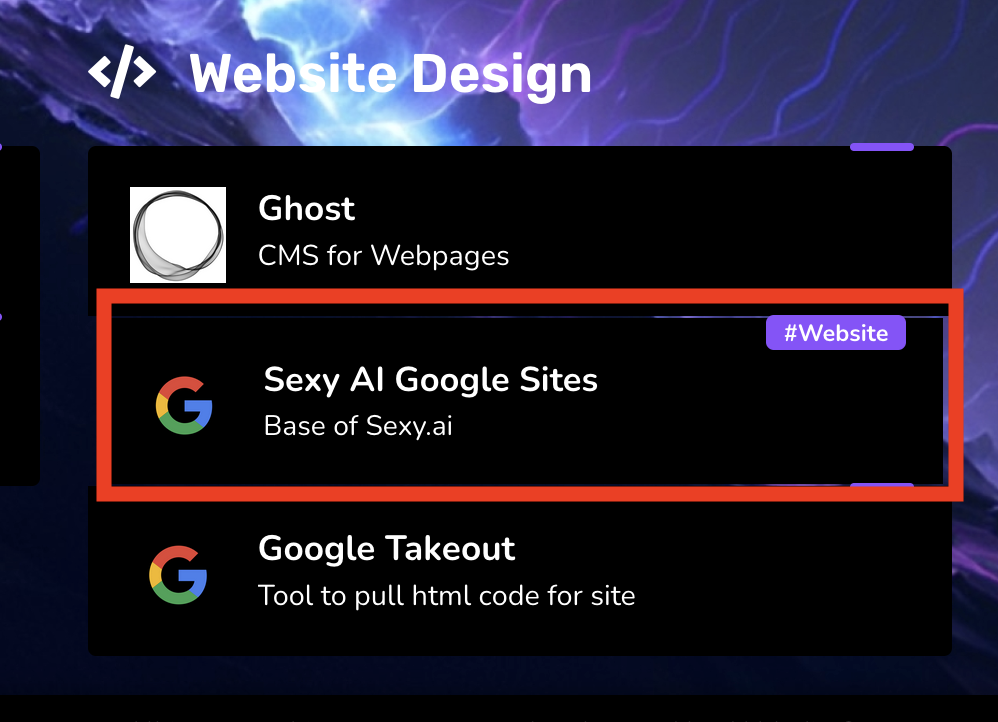

### Make Changes
- Make the necessary changes to the content or design of the website.
- Once you've made your changes, google sites will save automatically.
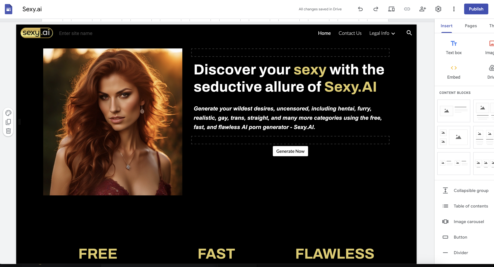

## Exporting Files using Google Takeout 

### Go To Dashboard
- Open your web browser and navigate to the employee dashboard and click on `Google Takeout` tab under the `Website Design` section.
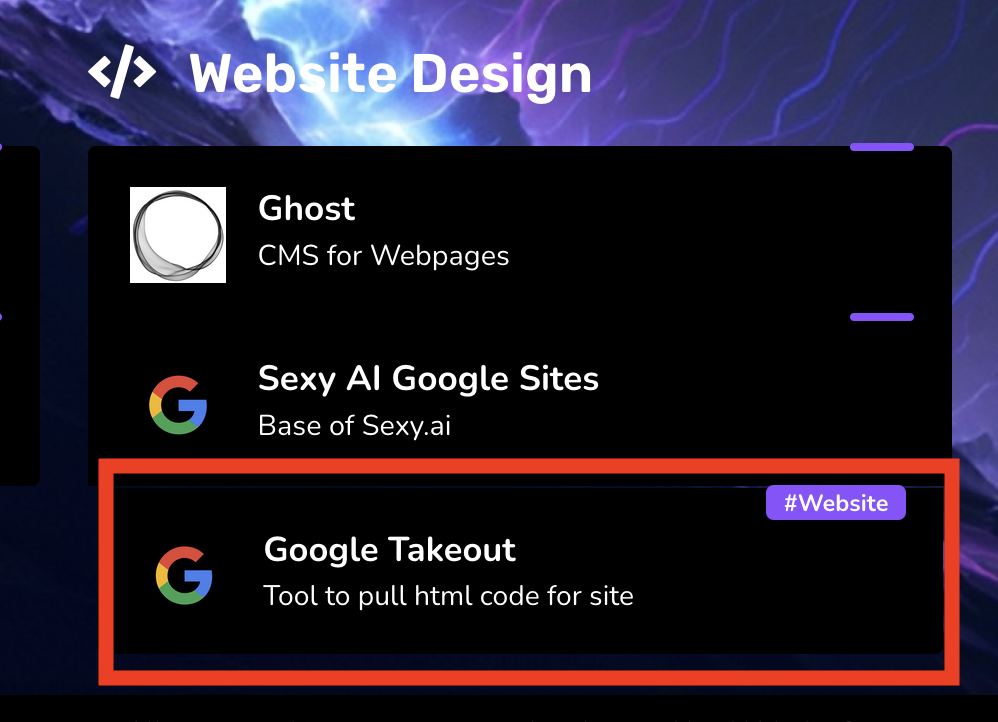

>[!TIP]
>Sign in with your Google account associated with AIMG.

### Deselect Items
- Scroll down to find `Deselect All` 
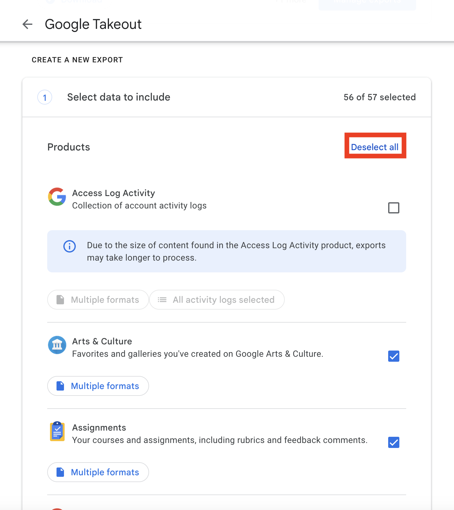

### Choose Google Drive
- Then **select** only `Drive`
- Click on `All Drive data included` to customize the selection.
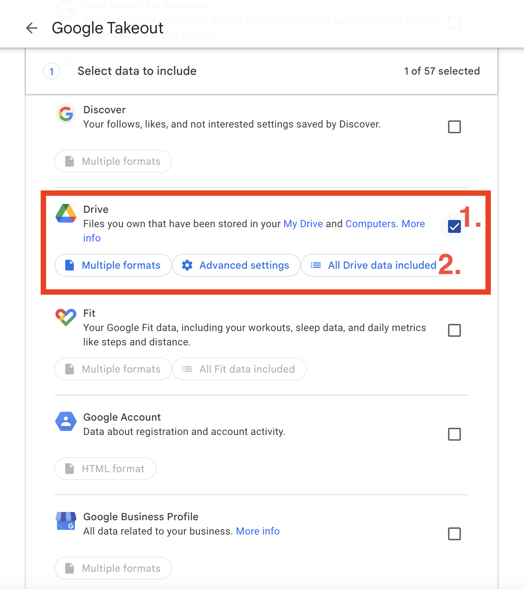

### Don't Include All Files
- Locate and **deselect** `Include all files and folders in Drive` so it won't export everything.
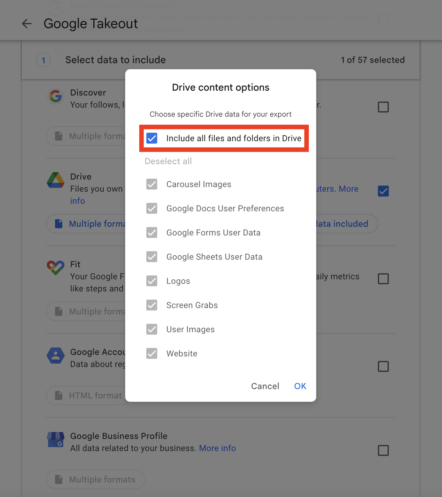

### Don't Include All Items
- Locate and **select** `Deselect all` so it won't export everything.
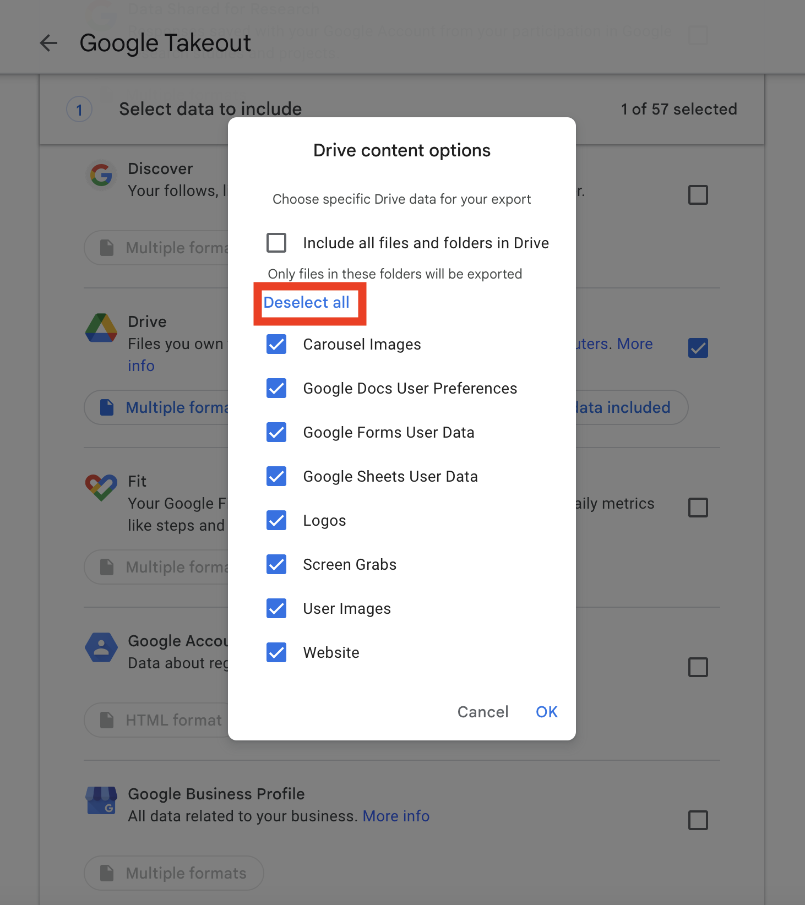

### Choose Website
- Locate and **select** `Website` it is the folder related to the Google Sites project.
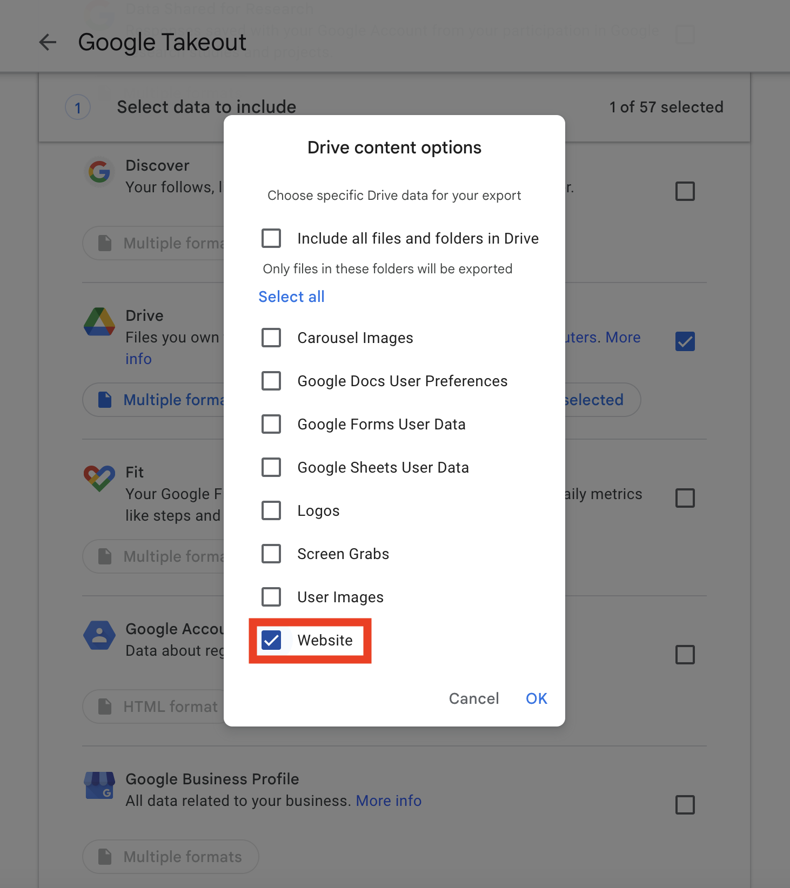

### Go To Next Step
- Click `Next step` to proceed.
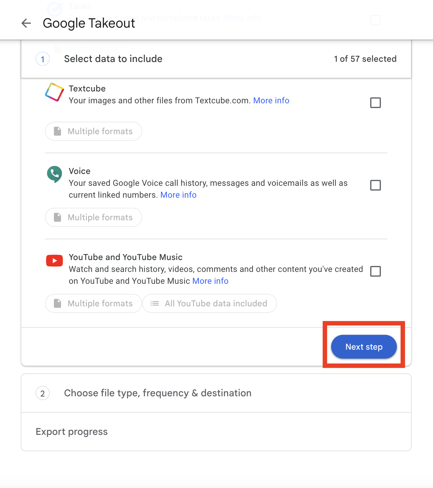

### Create Export
- Leave everything here as default and **select** `Create export`.
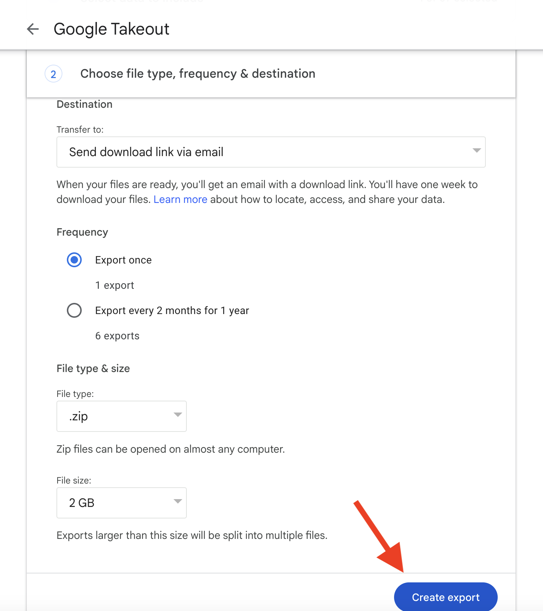

## Updating the GitHub Repository 

### Wait For Email
- Wait for Google to create a downloadable archive and send you an email notification.
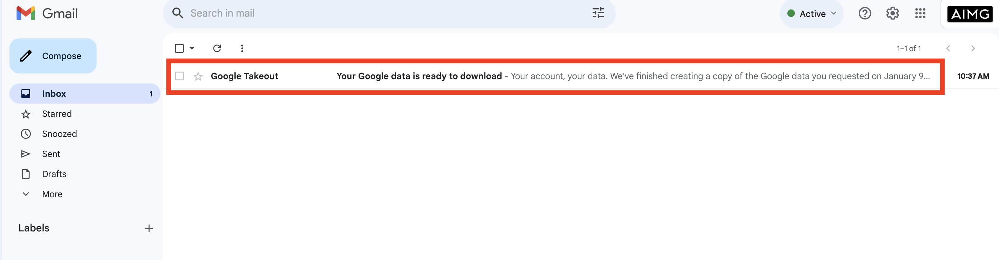

### Download Files
- Download the exported archive from the email notification received from Google Takeout.
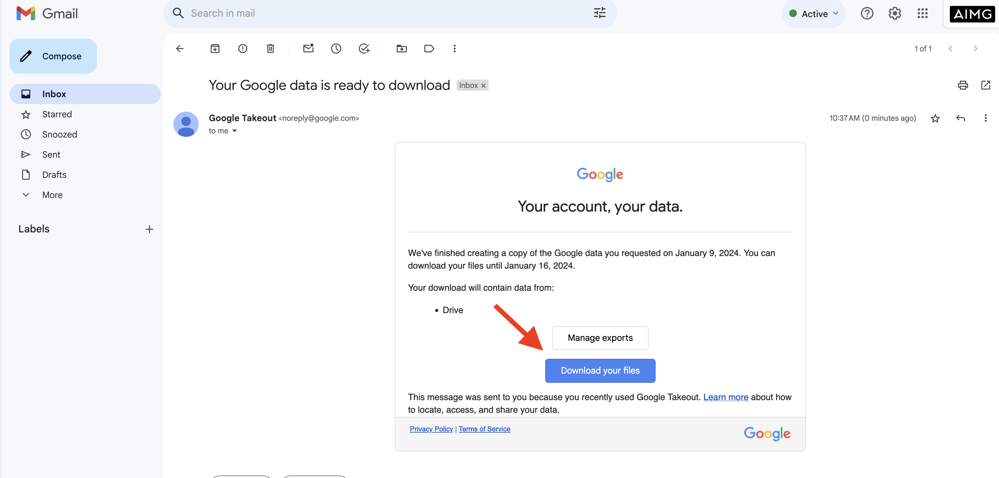

### Unzip File
- Go to the contents of the download on your local machine and unzip the file.
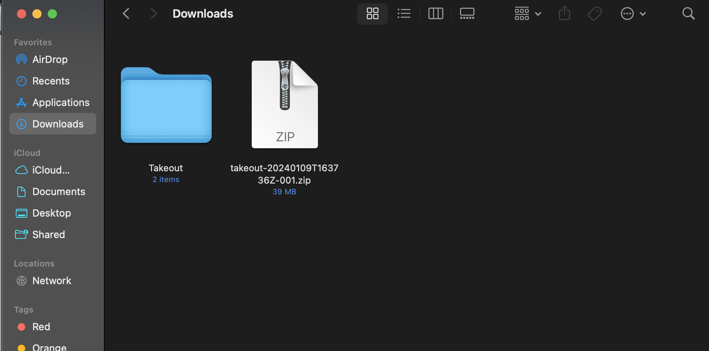

### Update GitHub Repo
- Travel into `Takeout > Drive > Website > Sexy.ai > DRAFT` here you will find the files used to update the repo.
- Open the GitHub repository associated with the project.
- update the files and push a commit. 

>[!NOTE]
>github actions will update the code on our web-server

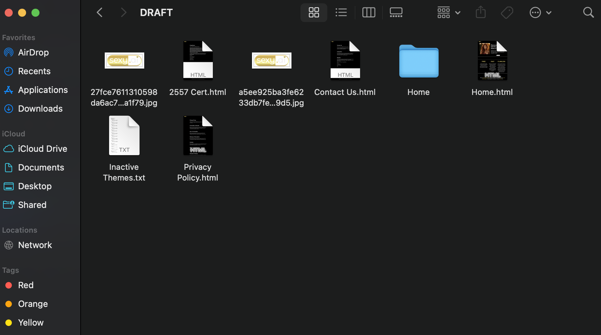

>[!TIP]
>To keep things simple please structure your commit message like this `Update 01/02/24` it is so we know the last time the site was updated.

Congratulations! You've successfully updated the Google Sites website and synchronized the changes with the GitHub repository. If you encounter any issues or have questions, please refer to the team or documentation for further assistance.